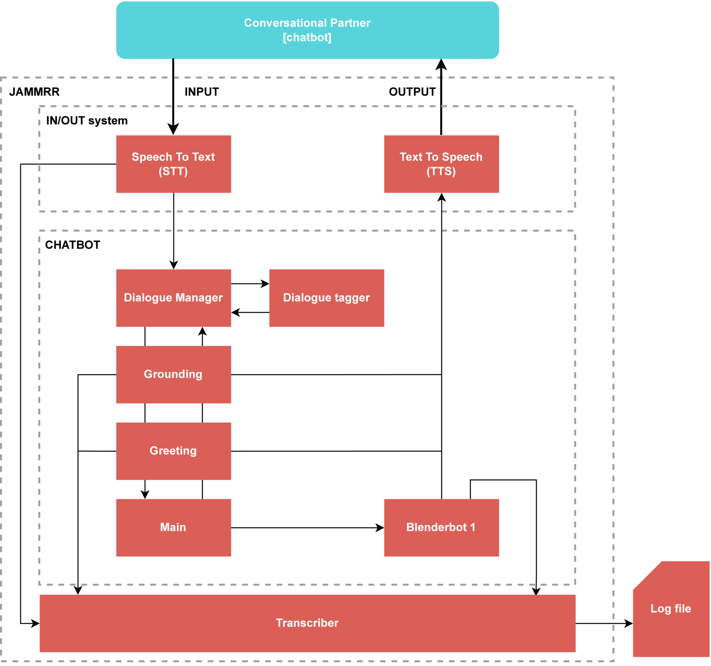

# 1. CIP-JAMMRR
 Conversational Interfaces: Practice - A project for the creation of the JAMMRR chatbot

## 1.1. Table of Contents
- [1. CIP-JAMMRR](#1-cip-jammrr)
  - [1.1. Table of Contents](#11-table-of-contents)
  - [1.2. General](#12-general)
    - [1.2.1. The project](#121-the-project)
    - [1.2.2. The chatbot](#122-the-chatbot)
  - [1.3. Running the chatbot](#13-running-the-chatbot)
    - [1.3.1. Requirements](#131-requirements)
    - [1.3.2. Using the chatbot](#132-using-the-chatbot)
    - [1.3.3. Turning off the chatbot](#133-turning-off-the-chatbot)

## 1.2. General
### 1.2.1. The project
This is a project that was made for the course [`Conversational Interfaces: Practice`](https://ocasys.rug.nl/current/catalog/course/LCX070M05) `2022/2023`, at the [`University of Groningen (RUG)`](https://www.rug.nl/).

The goal of the course was for the class to be split up into two groups to produce a chatbot for specific tasks that are set during the course. Our projects focused on the use of the creation of chatbots that could hold a conversation in a general and domain-specific way.

After the chatbot battle, this would then be used to write an internal paper for a grade.

### 1.2.2. The chatbot
The JAMMRR chatbot is a chatbot built with the following three core tenets in mind:

1. **(Research focus) Be able to hold a general and domain-specific conversation**.
2. Be able to talk in a 'human-like' fashion by way of:
   1. listening/understanding (a Speech-To-Text or STT system).
   2. speaking (a Text-To-Speech TTS system).
3. Be constrained to the general requirements of the CIP course project and ChatBotBattle.

**An overview of the chatbot architecture**



## 1.3. Running the chatbot
### 1.3.1. Requirements
To run the chatbot, one is required to install a small number of packages which can be found in `requirements.txt`.
This can be used as follows:

First, we recommend the creation of a virtual environment:
```bash
pip -m venv cip_jammrr
```

Following this, one can move into the virtual environment and install the requirements:
```bash
source cip_jammrr/bin/activate
pip install -r requirements.txt
```

### 1.3.2. Using the chatbot
As highlighted in [section 1.2.2.](#122-the-chatbot), the JAMMRR chatbot makes use of STT and TTS. Interaction with the chatbot is performed through the use of a microphone and speakers (or any other kind of input and output system for sound).

The program can be started by moving into the `prototype` folder and using Python to run `ml_system.py`:
```bash
cd prototype
python ml_system.py
```

**On runtime:**
1. After startup, JAMMRR will start by preparing the systems that will be used during its runtime (such as the language model).
2. Once the startup is finished, JAMMRR will start listening for input.
3. If no input is given, the current system will try to ask whether anyone is there, waiting for input from the conversational partner.
4. Once input is given, the chatbot will give a random greeting to its conversational partner.
5.Afterwards, the chatbot makes use of te language model to generate responses to given input.

### 1.3.3. Turning off the chatbot
As an explicit stop functionality has not been implemented for this version of the chatbot, one can stop the programme through the use of `multiple SIGINT signals (Ctrl + c), usually 2`.